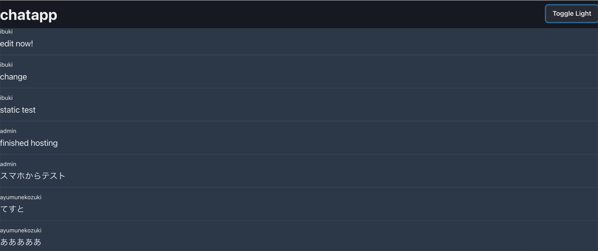
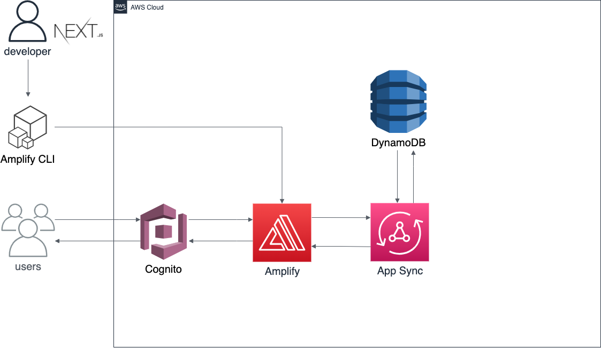

## 画像



## 技術

- Node.js@16.13.0
- Next.js@12.0.8
- Chakra UI
- AWS
  - Amplify
  - App Sync(GraphQL)
  - DynamoDB
  - Cognito

全てのバージョン等は[こちら](./package.json)に記載しています。

```
ユーザー管理機能(AWS Cognito)
チャットに必須のメッセージ送信・表示機能(AWS App Sync)
サーバーレス化を行いバックエンド周りを気にする必要がなくなったため管理が容易に(AWS Amplify)
```

## 歴史

- 21/10/26~ 構想・構築開始
- 21/11/02 version 0.1 完成
  - この当時の技術スタックとしては以下でした。
  ```
  firebase
  React
  ```
  
- 21/12/03 firebase x Next.js の構成で再度構築
  - リアルタイムでの取得関連で躓き挫折。
- 22/01/02 AWS を用いての開発を決定、開始
- 22/01/22 version 0.2 完成。(現段階)
